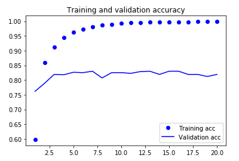
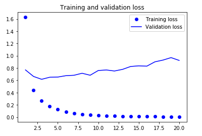
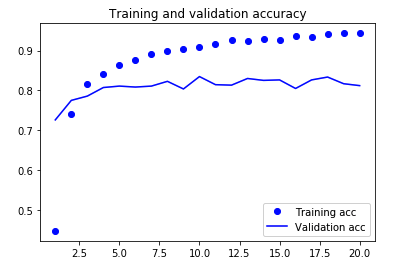
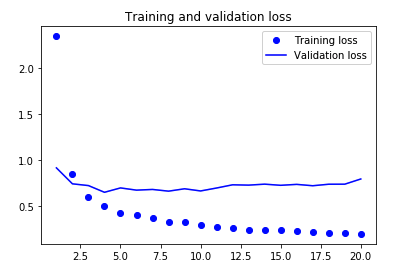

# CNN Dog Breed Classifier


## Project Overview
In this project, I developed a convolutional neural network capable of identifying and estimating a canine’s breed. If supplied an image of a human, the code will identify the resembling dog breed.

## Dataset
133 total dog categories.
8351 total dog images.
6680 training dog images.
835 validation dog images.
836 test dog images.

## Process
Because I was dealing with a relatively small dataset, I knew the number-one concern was going to be overfitting.

I took an empirically iterative approach to building this CNN. I started out by referencing a previous CNN I had built for the MNIST dataset. The MNIST dataset included simple (28, 28, 1) grey scale images, which is much smaller than the (224, 224, 3) images we are dealing with in the dog dataset. Given that we are dealing with larger images and a far more complex problem, it was evident that a larger network would be required. So I began to iteratively add Conv2D and MaxPooling2D stages to the network. This process both increases the capacity of the network and further reduces the size of the feature maps so that they are not too large upon reaching the flatten layer. In the end, I was disappointed with the test accuracy my model was achieving.

I decided to test out Transfer Learning for this problem. I chose to use Resnet50 with imagenet weights as my base ConvNet. The Resnet50 base was run over the dataset while recording its output to a Numpy array. This new dataset was then used as the input to the densely connected layer that was placed on top of the Resnet50 base.

```python
# Obtain bottleneck features from another pre-trained CNN
bottleneck_features = np.load('bottleneck_features/DogResnet50Data.npz')
train_Resnet50 = bottleneck_features['train']
valid_Resnet50 = bottleneck_features['valid']
test_Resnet50 = bottleneck_features['test']

# Define your architecture
Resnet50_model = Sequential()
Resnet50_model.add(GlobalAveragePooling2D(input_shape=train_Resnet50.shape[1:]))
Resnet50_model.add(Dropout(0.5))
Resnet50_model.add(Dense(133, activation='softmax'))

# Compile Model
Resnet50_model.compile(loss='categorical_crossentropy', optimizer='rmsprop', metrics=['accuracy'])

# Save the weights
checkpointer = ModelCheckpoint(filepath='saved_models/weights.best.Resnet50.hdf5',
                             verbose=1, save_best_only=True)

# Train the model
history = Resnet50_model.fit(train_Resnet50, train_targets, 
          validation_data=(valid_Resnet50, valid_targets),
          epochs=20, batch_size=20, callbacks=[checkpointer], verbose=1)
```

Prior to implementing feature extraction, I was achieving a test accuracy of 11% and after implementing feature extraction I was achieving a test accuracy 82%. I was blown away by the power of transfer learning!

While transfer learning increased my test accuracy substantially, I was still experiencing overfitting, which is illustrated in the plots below. To combat this, I decided to add a Dropout layer with a rate of 0.5 after the GlobalAveragePooling layer.

## Before Applying Dropout






## After Applying Dropout





As you can see, the level of overfitting has decreased a fair amount. I could decrease this even further by using augmented data in conjunction with feature extraction.
